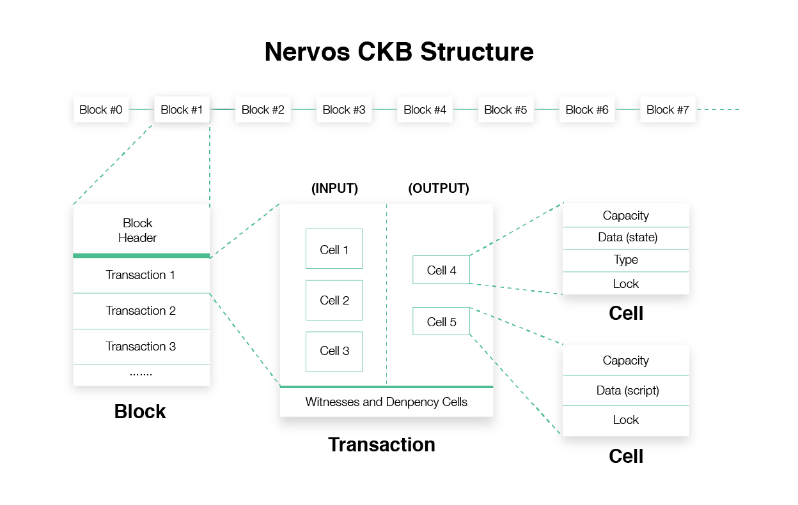

Here you can learn about the basic concepts of Nervos CKB. 

There are primarily 3 data structures you need to know in order to develop on CKB: Cell, Transaction and Block. We have prepared a [document](https://github.com/nervosnetwork/rfcs/blob/master/rfcs/0019-data-structures/0019-data-structures.md) for explaining every pieces of these data.

 <!--Up to here, bitcoiners may have noticed that CKB has a very similar structure to Bitcoin. That's why we have wrote up a quick guideline for you to bootstrap easily with your bitcoin background.--> 

 

## Cell

> More information about Cell can be found in the [Nervos whitepaper](https://github.com/nervosnetwork/rfcs/blob/master/rfcs/0002-ckb/0002-ckb.md#42-cell).

Cell is the most basic element in CKB system. A cell can be used to store a state or a script. 

A state cell may contain the information data of an application or an UDT (User-Defined-Asset), such as the balance of a user's ERC20 token. A script cell may contain the logic of an application or the rules of an UDT, such as the balance of an ERC20 token can not be negative. 

> It is feasible to let a cell store both the state and the logic of an application, but if this application wants to leverage the power of [layer2 solutions](https://github.com/Awesome-Layer-2/Awesome-Layer-2), this is really not recommended. This may result in the same problem of [why it is hard to implement EVM on Plasma](https://medium.com/@kelvinfichter/why-is-evm-on-plasma-hard-bf2d99c48df7).

In a single cell, the `capacity` part limits the size of this cell. The `data`, `type` and `lock` are the three parts a developer needs to be considered about when designing an application. 
* `data` stores the data of state or scripts. 
* `type` defines the type of a cell by defining how the `data` part can be modified. 
* `lock` defines the ownership of a cell. 

We will explain how to these parts work in the next section.

## Transaction

> More information about the Transaction of Nervos CKB can be found in [whitepaper](https://github.com/nervosnetwork/rfcs/blob/master/rfcs/0002-ckb/0002-ckb.md#44-transaction).

Transaction is for updating the cells on-chain (i.e. the state on-chain). Each transaction has a group of input cells (old states) and a group of output cells (new states). Transactions should be sent to a CKB node to get it verified and confirmed by the whole blockchain system, so the new cells can become valid on-chain.

> This is different from the transaction of Ethereum, where the transactions only have the event for updating the states stored on-chain. After received a transaction, Ethereum calculate the new state based on the transaction data and the old state on the blockchain system, then replace the old state with the newly calculated state. This basically mean that ethereum generate state on-chain, while CKB needs state to be generated off-chain.

To assemble a transaction, 4 parts need to be filled in: input cells, unlock scripts, output cells and the dependency cells. Now let's talk about how a transaction is verified, and hope it can help you to make sense of how these 4 fields should be filled.

After a CKB node received a transaction. It first get verified by the rules defined by the CKB system, such as the sum capacity of the output cells should be lower than the input cells.

> The sum capacity difference of the input and output cells are collected by the miner as mining fees.

> Every Cell has two conceptual status: live (unspent) or dead (spent). It is required by the transaction verification that, only the live cells can be used in a transaction as input. After a transaction is mined and confirmed on-chain, its input cells become "dead", and the output cells get the status of "live". It is this mechanism that prevents double spending from happening.

Apart from the rules defined by CKB system, a transaction also needs to be verified by the scripts specified by the `lock` of input cells and the `type` of output cells. This is the part that is crucial for understanding how to define the transition behavior of the on-chain state.

As mentioned above, `lock` defines the ownership of the cell. In a transaction, there is a group of `inputs`. Each of the `inputs` has two values: an input cell (which is noted as `previous_output`) and an `unlock` script. (I.e. the `inputs` field is an array of `{previous_output, unlock}`.) When the transaction is verified, it is required that the hash of the `unlock` script should be identical to the hash stored in the `lock` field of the corresponding cell. The `unlock` script will then be executed, so that the ownership of this cell is verified.

A typical `unlock` script may contain the information of the cell owner's public key and the signature of the transaction. During the verification process, the script verifies if the signature match with the public key stored in the `unlock` script, to make sure the transaction is indeed signed by the owner of the input cells. This process is very similar to the [P2SH](https://en.bitcoin.it/wiki/Pay_to_script_hash) scheme in Bitcoin.

`type` defines how the data of a cell can be modified. In a transaction, when there's a group of input cell and a group of output cell that have the same `type` field, then the modification of the `data` fields from the input cells to the output cells needs to comply with the rules defined by the `type` script. 

For example, Alice has a cell, whose `data` field stores the balance of a kind of UDT, and its `type` field refers to a cell that defines the rules and logic of this UDT. If Alice wants to send some of this UDT to others, then she would use this cell as input, and make another cell that has the exact same `type` field with this one as output, then assemble the transaction and send it to the CKB node. (Alice also needs to make another output cell for herself as the changes she needs to keep for herself) 

After received the transaction, the CKB node would first verify the `lock` and the `unlock` script of this input cell, to make sure that Alice indeed owns the cell. Then it verifies the `type` script of the output cell, which is same to the `type` script of the input cell, to make sure the UDT transaction is valid according to the rules defined by the `type` script.

> In theory, `lock` script can replace the function of `type` script, as they both can access all the information about the transaction. Still, `type` field is still added by the design of Nervos protocol, in order to explicitly show the type of cells. This may improve the readability of the transaction data, so that it is easier for the development or doing security audits.

The scripts doesn't need to be included in the `type` directly. It can also refer to a script stored in another cell through the `reference` field. When the verification of a transaction has the dependencies of the cells derived from other transactions, these cells should be explicitly referred in the `deps` field of this transaction.

> During the verification process, the specified scripts is loaded and executed in a CKB-VM instance. Check the [CKB-VM RFC](https://github.com/nervosnetwork/rfcs/tree/master/rfcs/0003-ckb-vm) to learn more about how it works in the CKB-VM.

For learning about how to write `script` in practice, please refer [how to write contracts on Nervos CKB](https://github.com/nervosnetwork/ckb-demo-ruby-sdk/blob/develop/docs/how-to-write-contracts.md#script-model).

## Block

Block contains a pack of transactions and a block header with some meta-data. It is the miner's job to pack transactions into a block and do the Proof-of-Work calculation to find a "seal" to seal the block, then broadcast it to the whole network. Other miners would receive this block, verify it, collect transactions and start to mine a new block based on this received block. 

Basically, this part of knowledge is actually not necessary for the developers to be familiar with (unless it is the miner software you are looking to develop), please refer [this document](https://github.com/nervosnetwork/ckb/blob/master/docs/data-structures.md) for the detailed information of the block structure.
