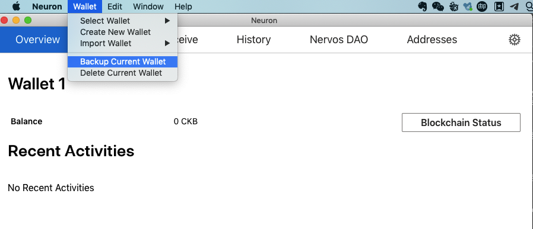
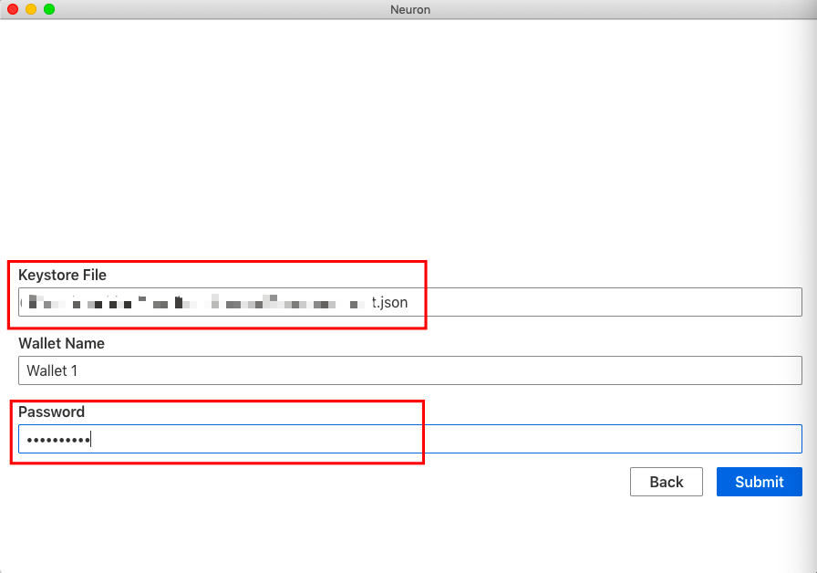
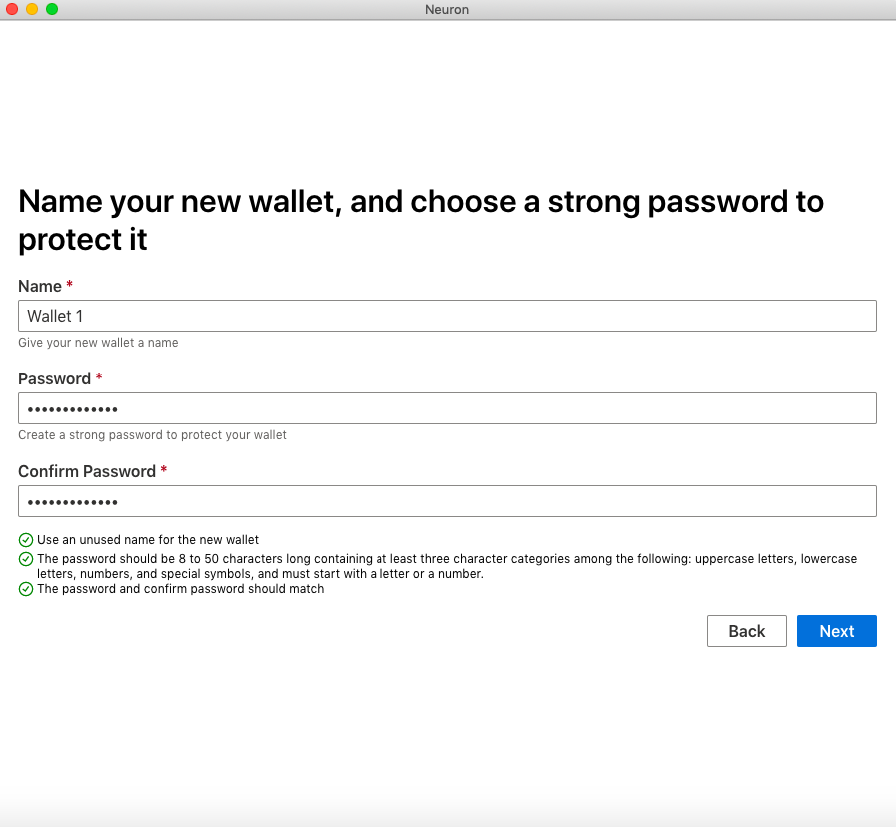
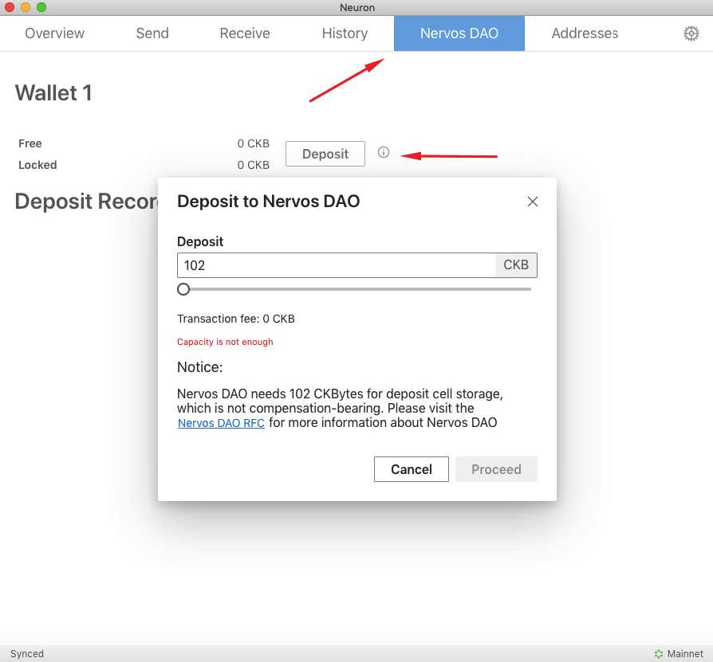

Since the Nervos CKB mainnet launched, over 923 Million CKBytes have been deposited into the Nervos DAO (at the time of writing). The Nervos DAO allows users to lock CKBytes (that are not being used) and receive **rewards** from secondary issuance. 

Please refer to [Nervos DAO Explained](https://medium.com/nervosnetwork/nervos-dao-explained-95e33898b1c) for more details. In this section, you will learn about how to deposit CKByte tokens into Nervos DAO.

Please follow these instructions:
#### Step 1: [Run a CKB Mainnet node](/getting-started/run-node)
#### Step 2: Download and install Neuron Wallet

  * Download the latest release version of the Neuron Wallet from the [Neuron Wallet releases page on Github](https://github.com/nervosnetwork/neuron/releases) and install it. **Please make sure that the CKB Mainnet Node (v0.25.2 or later) is running**. 

#### Step 3: Create a new wallet, or import your keystore file or seed phrase to the Neuron Wallet

* If you are using a new wallet, you can simply follow the steps within the Neuron Wallet.

* If you are importing an existing wallet which the private keys were generated by Neuron Wallet and the [Neuron Key Manager](https://github.com/nervosnetwork/neuron-key-manager), please import your private keys into the Neuron Wallet. This can be done using the mnemonic seed phase that was given to you when creating your address via Neuron Wallet and the keystore file when backing up wallets.

*Screenshot of example wallet seed when creating address using the Neuron Key Manager and Neuron Wallet*

*Screenshot of backing up example wallet from Neuron Key Manager*

*Screenshot of backing up example wallet from Neuron Wallet*

  - To import the keystore file, choose “Import from Keystore” and input your password - Wait for synchronization to end. **The password must match the original password from the Neuron Key Manager and Neuron Wallet.**

- To import the mnemonic seed phrase, choose “Import Wallet Seed”, fill in your password and wait for synchronization to end. **The password does not need to match the original password from the Neuron Key Manager.**

Congratulations, once the Neuron wallet is synced, you will have full access to your tokens! Now you can deposit CKBytes into the Nervos DAO.

#### Step 4: Deposit into Nervos DAO

**Please make sure your balance is greater than 102 CKB.**

