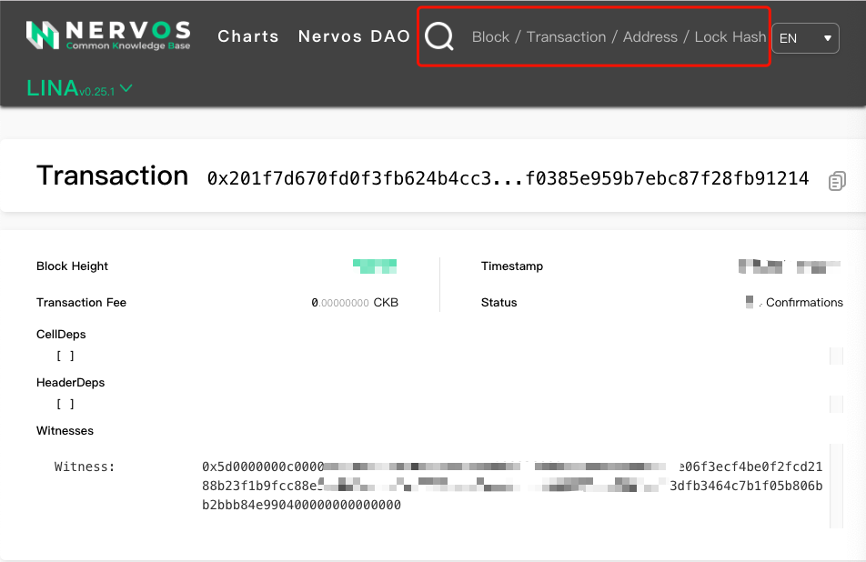
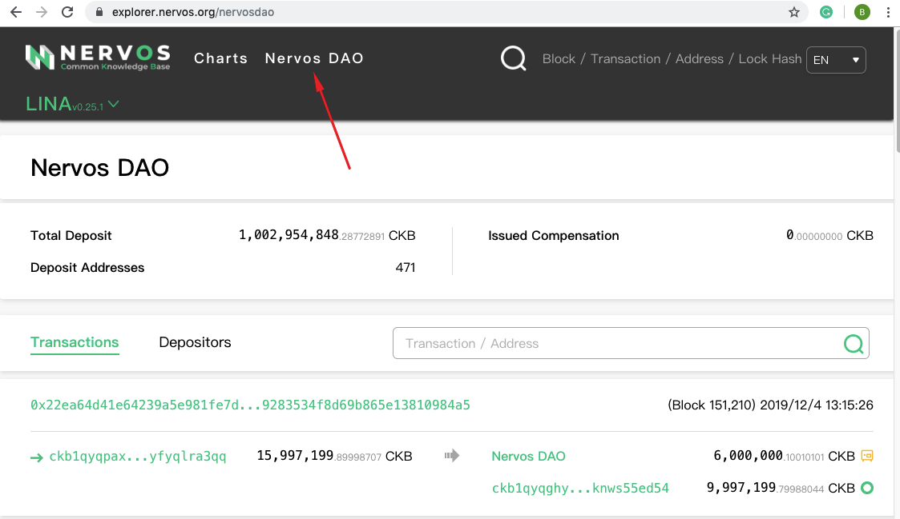

[CKB-Explorer](https://explorer.nervos.org/) is a blockchain explorer and analytics platform for Nervos CKB. It is basically a search engine that allows users to easily lookup, confirm and validate transactions that have taken place on the Nervos CKB. 

CKB-Explorer facilitates blockchain transparency by indexing and making all Nervos CKB transactions searchable in the most accessible way possible.

**Please note that CKB-Explorer is not a wallet service provider, we do not store your private keys and we have no control over the transactions that take place over the CKB Network.**

To view a transaction on CKB-Explorer, please follow these instructions:

Step 1: Get the transaction’s hash

* Open Neuron Wallet, navigate to the “History” tab 
* Select one Transaction Hash value, copy it.

Step 2: Access the [CKB-Explorer](https://explorer.nervos.org/), paste the Transaction Hash in the search bar
The Transaction’s info will then be displayed.

**Nervos DAO on CKB-Explorer**

CKB-Explorer also provides an overview of the Nervos DAO deposits, withdrawals and rewards. Since the Nervos CKB mainnet launched, over 920 Million CKBytes have been deposited into the Nervos DAO (at the time of writing).

