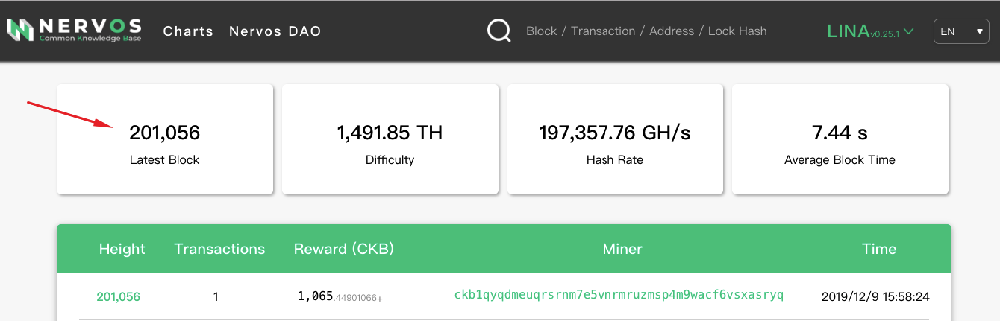
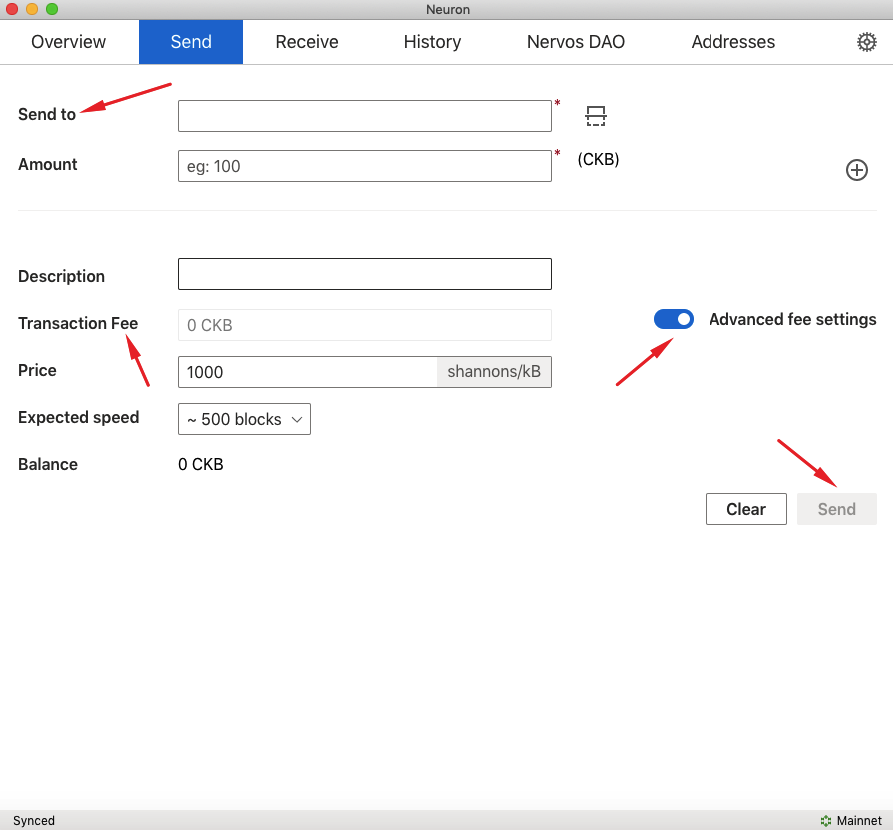

Neuron Wallet is an official Nervos CKB wallet. It holds users’ keys, can create and broadcast transactions to the peer to peer network. Before transfering CKBytes,please prepare the third party wallet/exchange destination address in advance. **Please make sure your balance is greater than 62 CKB.**

Step 1: Download and install Neuron Wallet
Download the latest release version with a bundled CKB node from the [releases page on Github](https://github.com/nervosnetwork/neuron/releases) and install it. **Please make sure the version is v0.26.0 or later.**

Step 2：Create a new Wallet and wait for the synchronization to end.
**Please note that you need to wait for the synchronization to end.** You can cross-check the `Block Number` with CKB-Explorer's `Latest Block` to make sure the synchronization to end.

Step 3：Transfer CKBytes from Neuron Wallet to the third party.

* Under the `Send` tab, fill in the address details in the `Send to` field. Click the `Max` to add multi-transactions. Turn on the `Advanced fee settings` and fill in the `Transaction fee` — click the `Send` button to complete your transfer.

