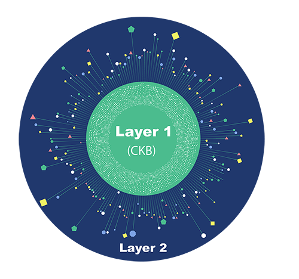

Nervos is an infrastructure platform for the future Crypto Economy, where assets are represented by tokens and are traded in an open financial system. On this platform, there is a token named CKB that serves as a “Store of Assets”, securing this platform and all the assets (tokens) on it.

Nervos has a layered architecture, which has a Layer 1 named Common Knowledge Base (CKB) as the foundation layer for securely storing all the assets. There are also Layer 2 systems works around CKB as plugins for enabling lower transaction fee and better transaction user experience for transferring the assets on CKB.

## Nervos CKB

Nervos Common Knowledge Base (CKB) is a permission-less public blockchain system that supports smart contract functionality.

> CKB is both the token name and the name of the blockchain.

In a blockchain context, common knowledge refers to states verified by global consensus and Nervos CKB is designed to be a state verification system.

To compare with, Bitcoin is designed to be programmable money while

Nervos CKB generalizes Bitcoin's model to support User Defined Tokens (UDTs) and smart contracts with a RISC-V virtual machine and PoW consensus that can scale up when network conditions permit.

