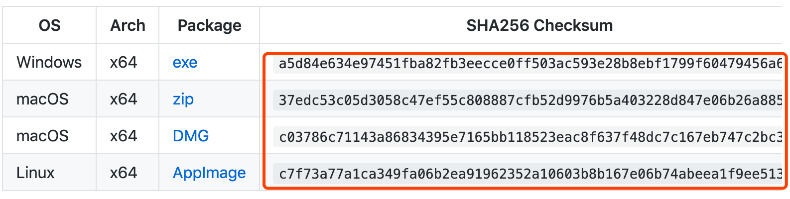

To manage your assets on Nervos CKB, you will need a Neuron Key Manager application. This tutorial covers how to install and use the basic features of Neuron Key Manager.

## Install

1. Go to [Neuron Key Manager](https://github.com/nervosnetwork/neuron-key-manager/releases) download page

2. Choose the correct file based on your device operating system
   


3. [Optional] Check the downloaded file's integrity according to the SHA256 checksum published on the download page.




4. Install the file on your device

## Open

- ### Windows

When you open the application for the first time, you may get this message (see below). Click `More info`

 

Then click `Run anyway`:


- ### MacOS

When you open the application for the first time, you may get this message (see below).


The solution is to open `System Preferences`, and click `Security & Privacy`, you will see this message (see below), click `Open Anyway`.


Then re-open the Neuron Key Manager application: ( click `Open` )


- ### Linux

Make the downloaded AppImage file executable before using it. Open a terminal and run the following shell code.

```
chmod a+x Neuron-Key-Manager-linux-x86_64.AppImage
```

## Disclaimer

- For U.S. Residents


- For Non-U.S. Residents


## Get Started

There are 3 ways to generate a wallet:
- Start from scratch
- Recover wallet 
- Import from keystore file

### 1. Start from scratch

#### Step 1: Create a wallet


#### Step 2: Save wallet seed (mnemonic) phrase

- The wallet seed is the mnemonic phrase of the private key. You can use these words to recover your wallet (address).

- Record and save them these words in a safe place.

 

#### Step 3: Input wallet seed (mnemonic) phrase

Input wallet seed (mnemonic) phrase from step 2.


#### Step 4: Name your wallet and set password

The password is used for security-related actions, eg:
- backup wallet
- delete wallet 


#### Step 5: Address generated 


> **This address can be used as the *Receiving Address* for the Nervos token sale on [Coinlist](https://coinlist.co/nervos).**

> **Please keep the seed (mnemonic) phrase and keystore file safe. Do not disclose the details to anyone or you may risk losing all of your tokens.**

> **You can use the seed (mnemonic) phrase or keystore file to manage your tokens after Nervos CKB mainnet launch.**

#### Step 6: Genereate more addresses

The Key Manager application only supports one address at present. To generate more addresses, you should delete current wallet and re-create new wallet.

> Click "wallet" menu and "delete wallet" submenu to delete existing wallet.

> **Double confirm that you have backup your seed (mnemonic) phrase and keystore files before delete the wallet from Key Manager.**

### 2. Recover wallet 

#### Step 1: Click "Import Wallet Seed" tab


#### Step 2: Input wallet seed (mnemonic) phrase


Follow the next instructions to complete the process.

### 3. Import from keystore file

#### Step 1: Click "Import From Keystore" tab


#### Step 2: Input keystore file

The password is the password set previously when the wallet was backed up.


And follow the next instructions.

## Backup wallet

Backup your wallet into a keystore file, and recover the wallet from keystore file when you need it.

#### Step 1: Click "Backup Current Wallet"


#### Step 2: Input password

Set a password to protect the keystore file. When you recover the wallet from the keystore file, you will need to input the password.

 


#### Step 3: Choose where to store keystore file

 

> **Notice: if you lose your wallet, nobody can recover it. So remember to backup all the information!**
