To manage your assets on CKB, you will need a neuron key manager app. This tutorial covers how to install and use the basic features of neuron key manager.

## Install

1. Go to [download](https://github.com/nervosnetwork/neuron-key-manager/releases) webpage
2. Choose correct package of your platform
   

3. Install package in your device

## Open

- ### Windows

When you open the app first time, you may get this: ( tap `More info` )

 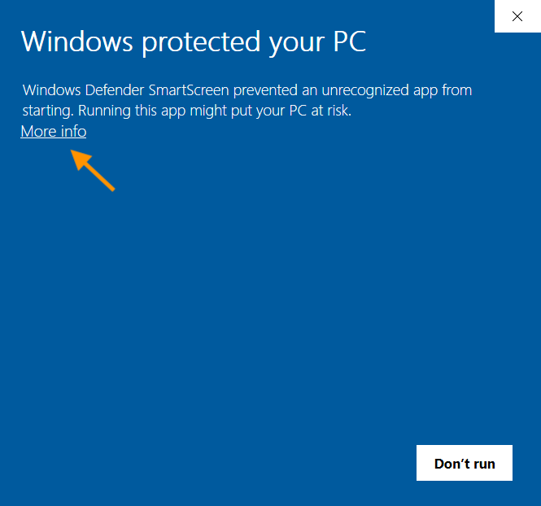

Then tap `Run anyway`:

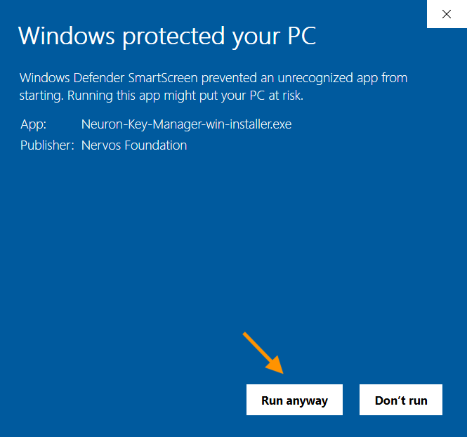

- ### MacOS

When you open the app first time, you may get this:

The solution is to open the `System Preferences`, and tap `Security & Privacy`, you will see this: ( tap `Open Anyway` )

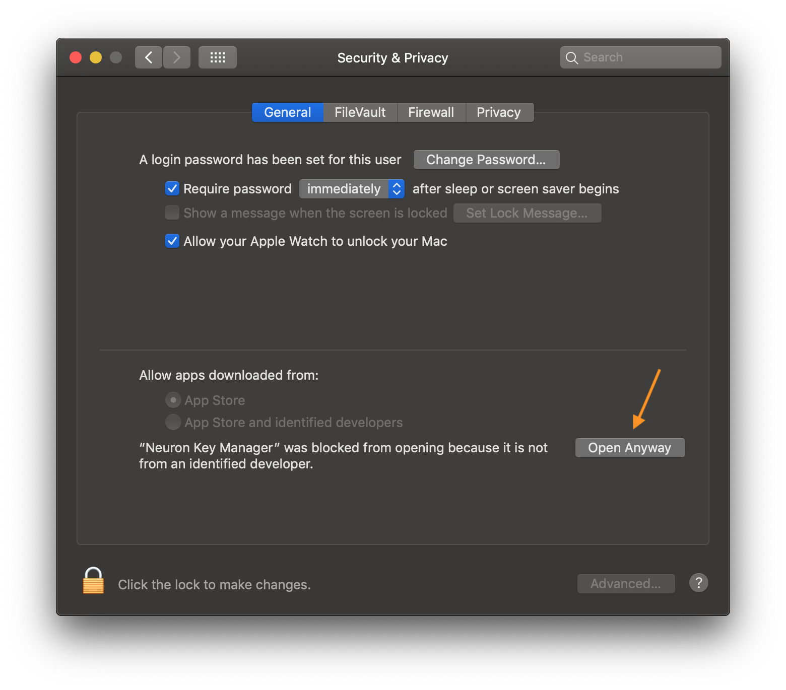

Then re-open neuron key manager app: ( tap `Open` )

## Agreement

- For U.S. Residents

- For Non-U.S. Residents

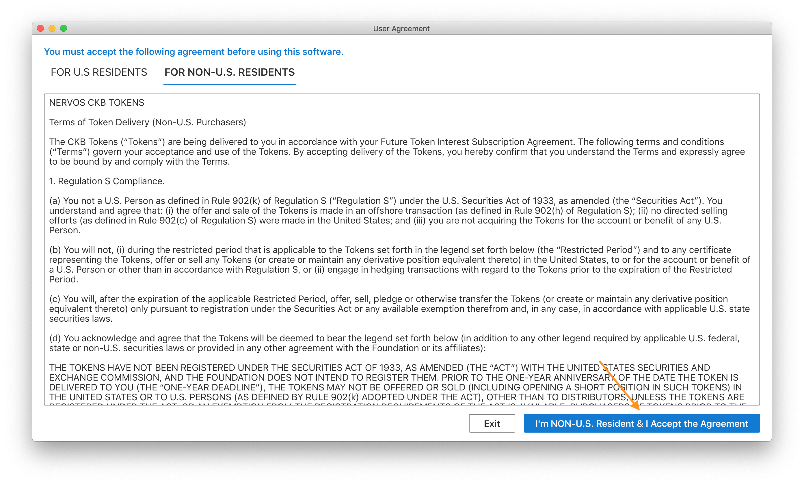

## Get Started

There are 3 ways to generate a wallet:
- started from scratch
- recover wallet 
- import from keystore

### 1. Started from scratch

#### Step 1: Create a wallet

#### Step 2: Save wallet seed

- wallet seed is the mnemonic word of private key, you can use it to recover your wallet ( address ).

- you should save it in a safe place.

 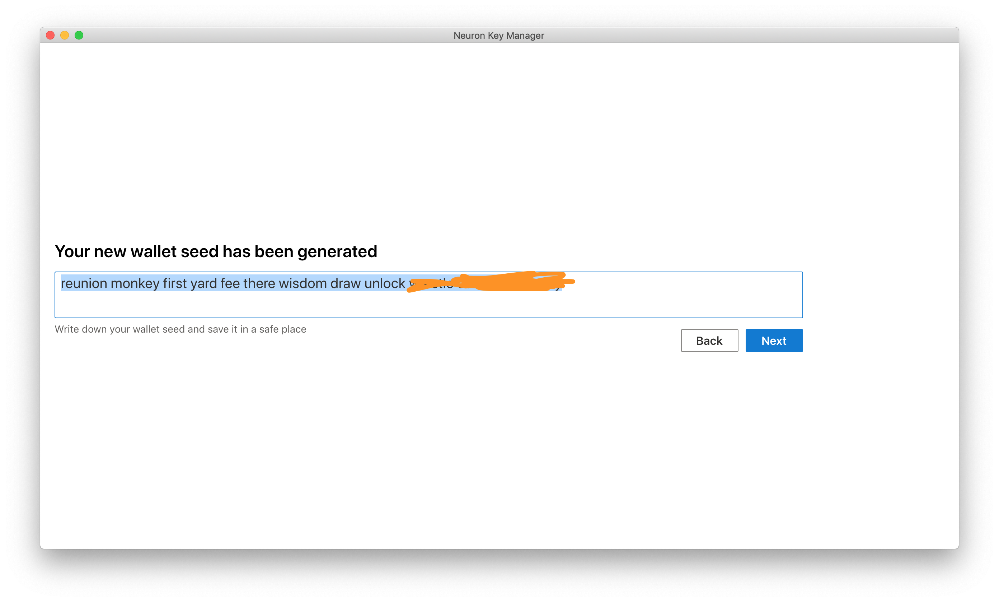

#### Step 3: Input wallet seed

Input wallet seed of step 2.

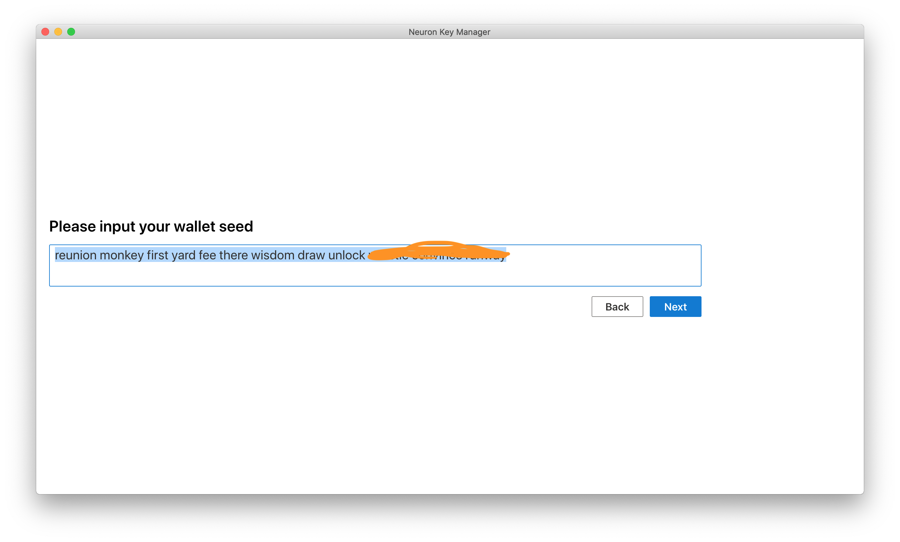

#### Step 4: Name your wallet and set password

The password is used to do security-related action, eg:
- backup wallet
- delete wallet 

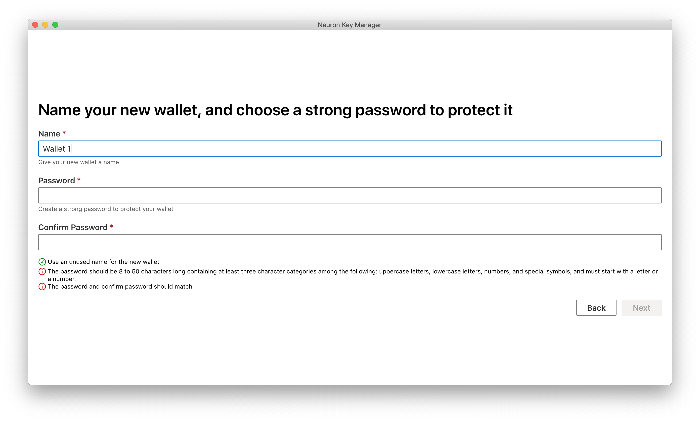

#### Step 5: Address generated 

> **This address can be used as receiver address of Nervos Coinlist.**

> **Please keep the mnemonic safe, and manage the token received in future.**

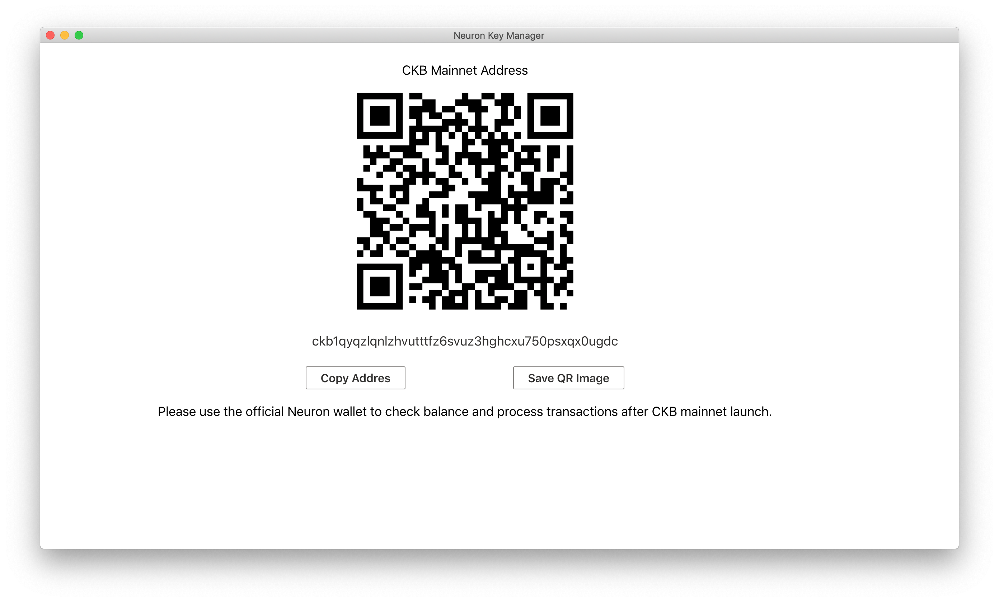

### 2. Recover wallet 

#### Step 1: Tap "Import Wallet Seed" tab

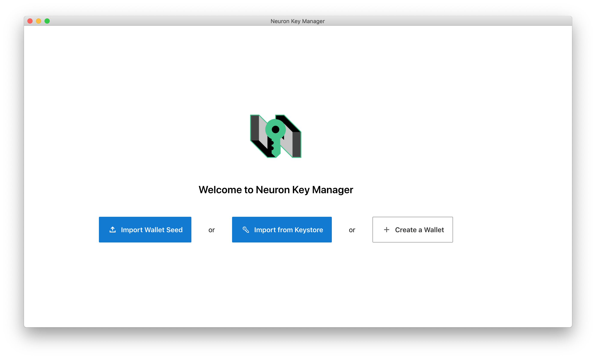

#### Step 2: Input wallet seed

And follow the next instructions.

### 3. Import from keystore

#### Step 1: Tap "Import From Keystore" tab

#### Step 2: Input keystore file

Password is the password you set when backup wallet.

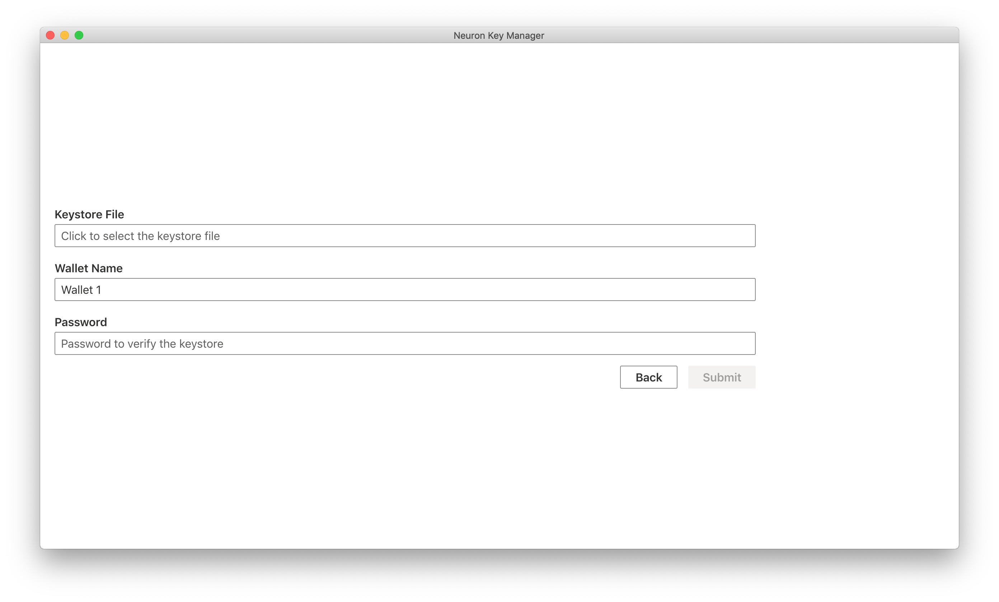
And follow the next instructions.

## Backup wallet

You can backup your wallet into a keystore file, and recover wallet from keystore when you need it.

#### Step 1: Tap "Backup Current Wallet"

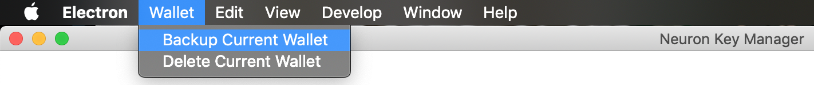

#### Step 2: Input password

Set a password to protect keystore file. And when you recover wallet from keystore, you will input the password.

 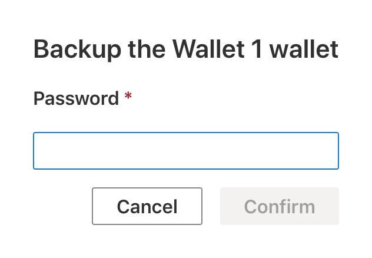

#### Step 3: Choose where to store keystore file

 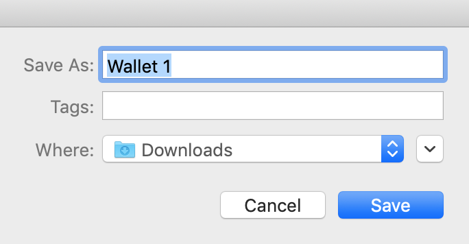

> **Notice: if you lose your wallet, nobody can recover that. So remember to backup!**
