## How to get your Nervos CKByte Mainnet Tokens after Mainnet launch 

**Please note that this tutorial is only for people who hold a keystore file or a mnemonic seed phrase generated from the Neuron Key Manager.**

Following mainnet launch, if you hold a keystore file or a seed phrase generated from the Neuron Key Manager, you can use the Neuron wallet to receive your tokens. In order to use the Neuron wallet, a local CKB node is required to sync with the Nervos CKB blockchain. 

Please follow these instructions, which are detailed below：

1. Download and run a CKB mainnet node (see instructions below).
2. Download and install Neuron Wallet.
3. Import your keystore file or seed phrase to the Neuron wallet **with the CKB node running** and wait for the synchronization to end.

Bonus guides: 

1. Deposit into Nervos DAO
2. Withdraw from Nervos DAO
3. How to transfer CKBytes from the Neuron Wallet to other wallets and exchanges

If you run into issues when following this guide, please join the [official Nervos Telegram](https://t.me/NervosNetwork) channel for support. 

**IMPORTANT The Nervos Team will NEVER ask for your Private Key, keystore file, mnemonic seed phase or wallet password. You should NEVER share this information with anyone, doing so may result in loss of all your tokens.**
* * *

### 1. run A CKB mainnet node

The Neuron Wallet needs to “talk” to the CKB blockchain in order to get information about address balances and to broadcast transactions to the network. Therefore, to use the Neuron wallet, you first need to run and sync a CKB node. Anyone can run a CKB node and connect to other nodes across the globe to form the decentralized network of the Common Knowledge Base (CKB).

*Fun Fact: Running a CKB node not only helps contribute to the robustness and decentralized nature of the Network, it also means you do not need to rely on any 3rd party to provide data from the blockchain which increases your security.*

Running a node requires using the command line. If you have never used a command line before, you may want to search online for a introductory tutorial. Although it may seem complicated at first, it is quite simple and you should be able to easily run a CKB node following the specific instructions below.

1. Download the released ckb binary file from the [CKB releases page on GitHub](https://github.com/nervosnetwork/ckb/releases). 

Click the most recent release (this must be **version 0.25.1 or later**）and then download the correct “asset” for your operating system. 

**Please note:** The version you download must be v0.25.1 or later, which is expected to be released within a few hours after the genesis block being mined).  Because ckb v0.25.1 isn’t released now , the screenshots are for illustrative purposes only.

2. Unzip / extract the downloaded file to an easily accessible folder. For Windows we recommend C:\ckb On Mac we recommend /Documents

3. Open up terminal or command line.

    1. On Mac:
        1. Either open your Applications folder, then open Utilities and double-click on Terminal, or press `Command - spacebar` to launch Spotlight and type "Terminal," then double-click the search result and the following steps are performed on Terminal.

    * On Windows:
        * Download Git for windows from [Git-Downloads](https://git-scm.com/downloads), double-click to install it and open **Git Bash** and the following steps are performed on Git Bash.

3. Copy and paste the commands below into the terminal / command line depending on whether you are using Mac or Windows:

please note: the directory and folder name must match the commands below

**Mac**

```
$ cd ckb_v0.25.1_x86_64-apple-darwin
$./ckb --version
$./ckb-cli --version
```

**Windows**

```
$ cd ckb_v0.25.1_x86_64-pc-windows-msvc
$./ckb --version
$ ./ckb-cli --version 
```

You should receive the following output confirming the CKB version:

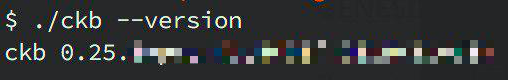

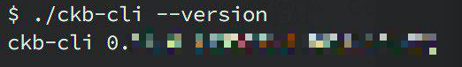

* To run the CKB node, copy and paste the commands below into the terminal / command line depending on whether you are using Mac or Windows:

**Mac & Windows**

```
$./ckb init --chain mainnet
$./ckb run
```

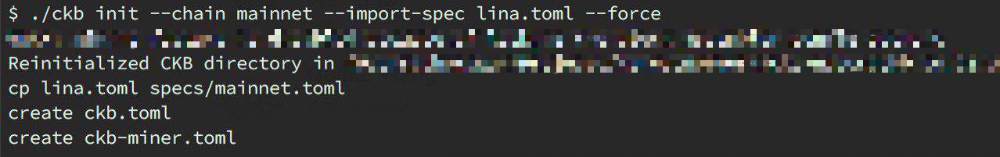

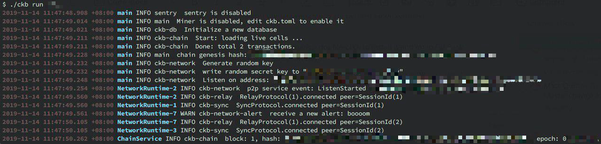

* * *

### **2.Download and install the Neuron Wallet**

Download the latest release version of the Neuron Wallet from the [Neuron Wallet releases page on Github](https://github.com/nervosnetwork/neuron/releases) and install it. **Please make sure that the CKB Mainnet Node (v0.25.1 or later) is running.** Import your keystore file or seed phrase that was previously generated by the Neuron Key Manager (full guide below), wait for the synchronization to end, and then you should see that the wallet’s balance has changed.

* * *

### **3. Import your keystore file or seed phrase to the neuron wallet**

Your private keys were generated by the Neuron Key Manager. You then created an address using the Neuron Key Manager which was added to the Genesis block to receive your token allocation. 

To access your tokens, you will need to import your private keys into the **Neuron Wallet**. This can be done using the Mnemonic seed phase that was given to you when creating your address via Neuron Key Manager (image 3.1) **or** by exporting the private key (keystore file) via the “Backup Current Wallet” option in Neuron Key Manager (image 3.2).

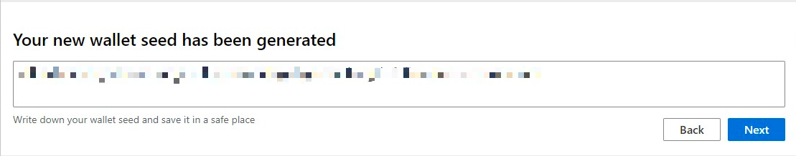

*3.1 Screenshot of example wallet seed when creating address using the Neuron Key Manager tool*

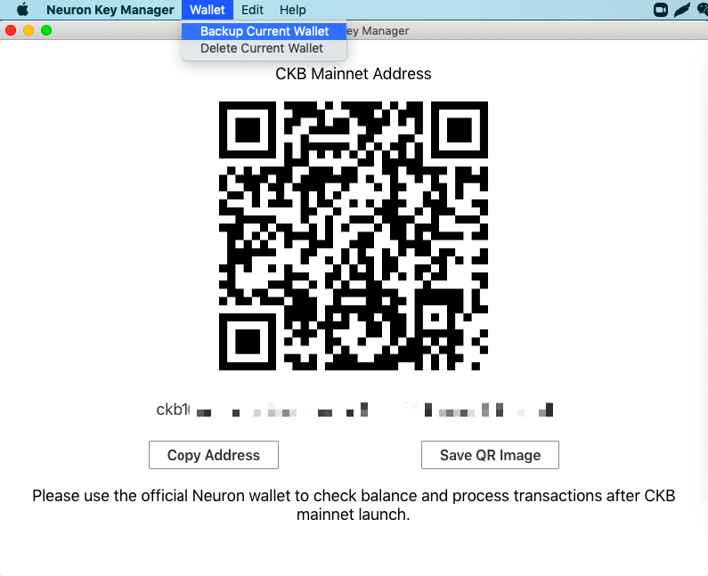

*3.2 screenshot of exporting private key from Neuron Key Manager tool*


1. backup / export your keystore file (a .json file matching the name you chose for your wallet)  from the Neuron Key Manager, **or** use the Mnemonic seed (a regular phrase of 12 words) generated when you create a wallet with the Neuron Key Manager.


2.  import the keystore file **or** Mnemonic seed phrase when setting up the Neuron wallet.

    * To import the keystore file, choose “Import from Keystore” and input your password - Wait for synchronization to end. **The password must match the original password from the Neuron Key Manager.**

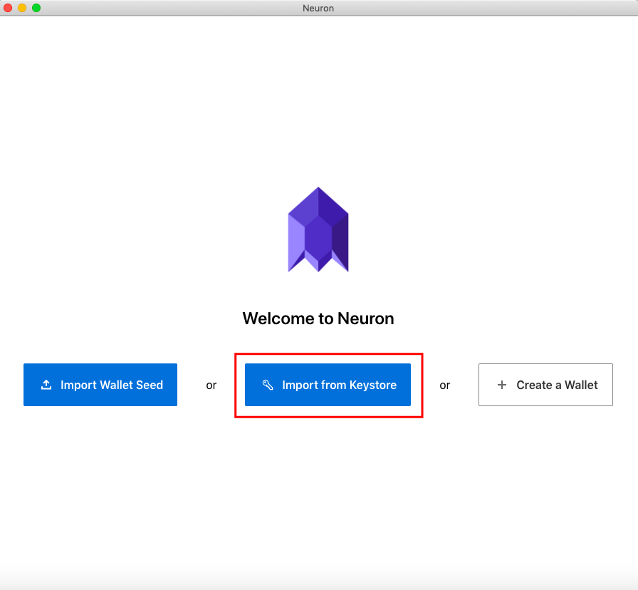

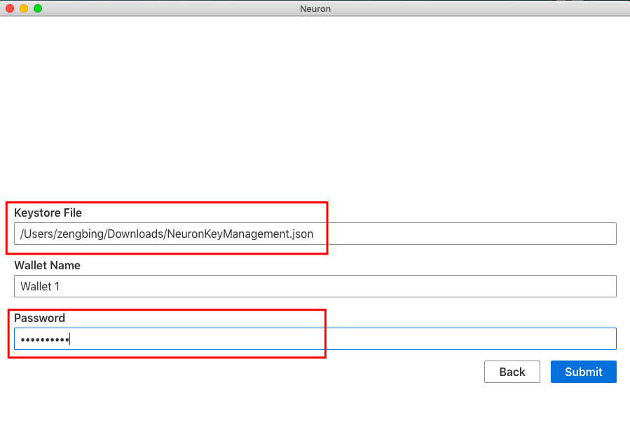


* To import the Mnemonic seed phrase, choose “Import Wallet Seed” and fill in your password - Wait for synchronization to end. **The password does not need to match the original password from the Neuron Key Manager.**


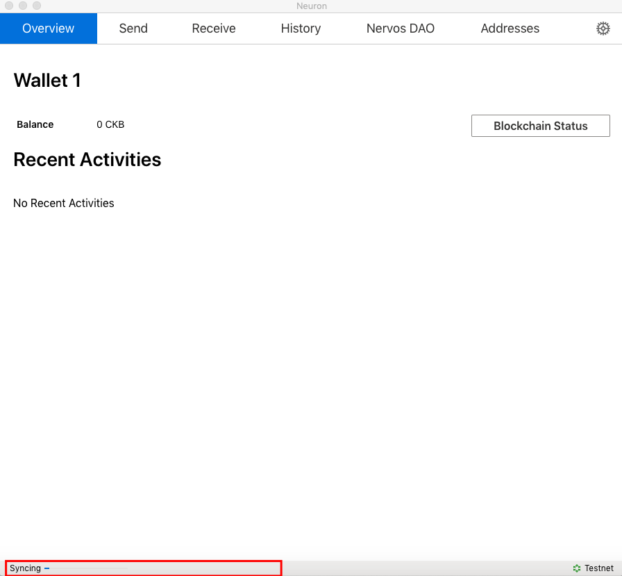

Congratulations, once the Neuron wallet is synced, you will have full access to your tokens! You can send  andreceive CKBytes and deposit in the Nervos DAO.

## How to deposit your Nervos CKByte tokens into Nervos DAO (*Recommended)

The [economic model](https://github.com/nervosnetwork/rfcs/blob/master/rfcs/0015-ckb-cryptoeconomics/0015-ckb-cryptoeconomics.md) of Nervos CKB is designed to allow token holders to lock tokens in the Nervos DAO to mitigate the inflationary effect of the Secondary Issuance. In this case, the inflationary effect of secondary issuance is expected to be nominal, equivalent to holding tokens with a hard cap. The Nervos DAO will be available at the launch of mainnet. (please refer to our RFC for details.) **Please make sure your balance is greater than 102 CKB.**

* Open the Neuron Wallet **while running the CKB Mainnet Node (v0.25.1 or later) **select “Nervos DAO” and “deposit”. 

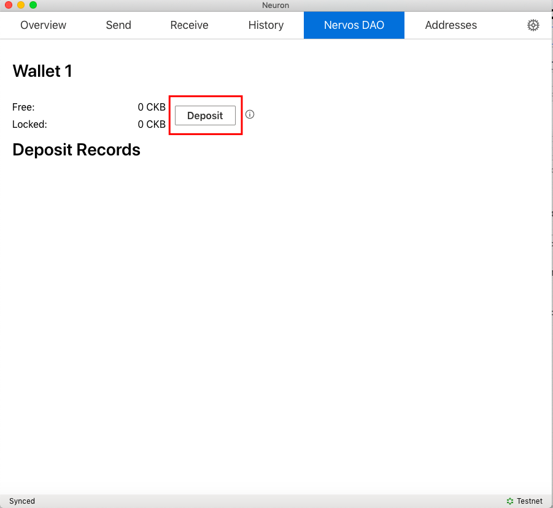

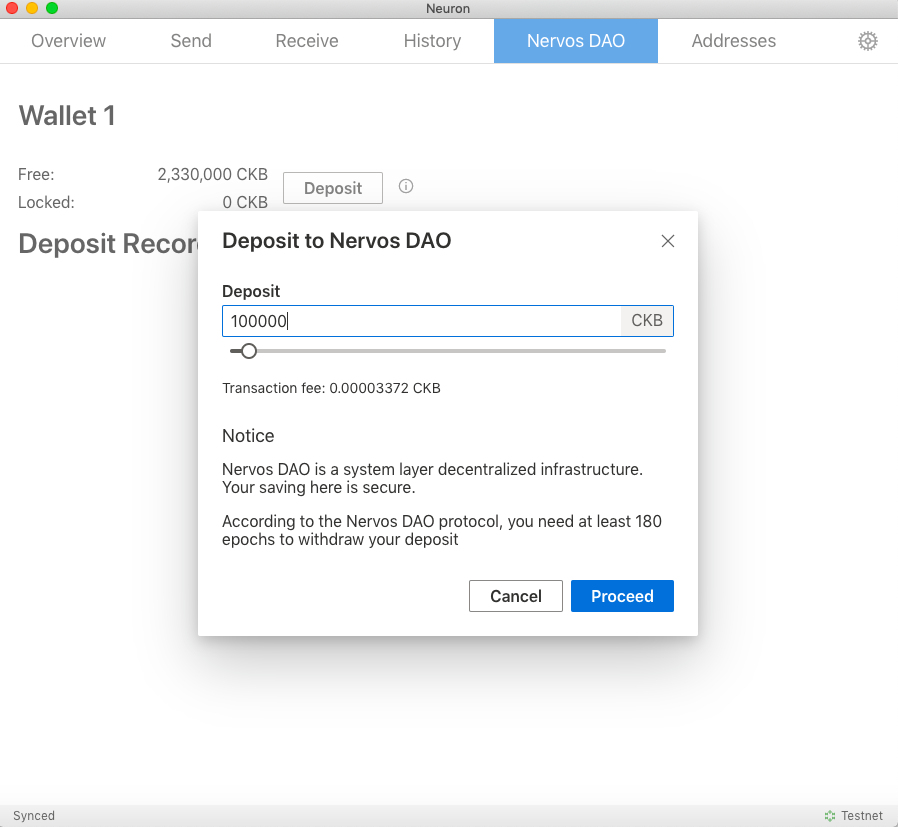

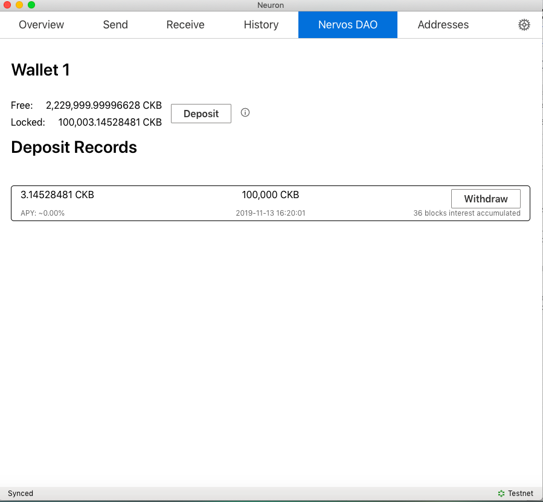

## How to withdraw your Nervos CKByte tokens from the Nervos DAO 

#### Please read the disclaimer below before transacting on mainnet 

`Deposit Records` will display deposit records’ list，you can click `withdraw`.

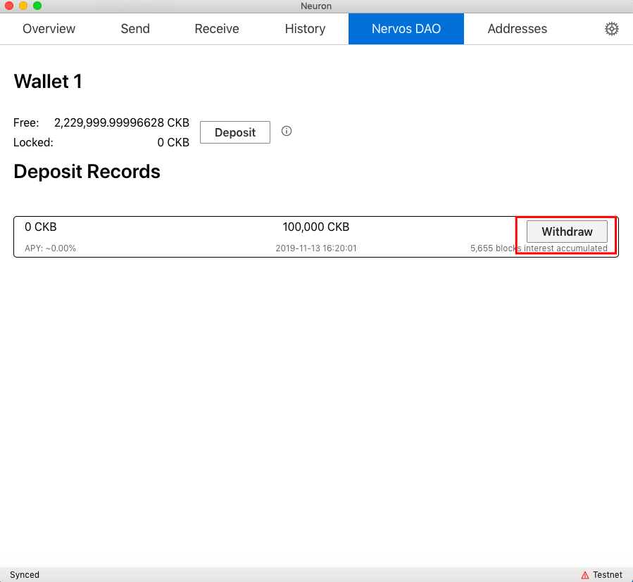

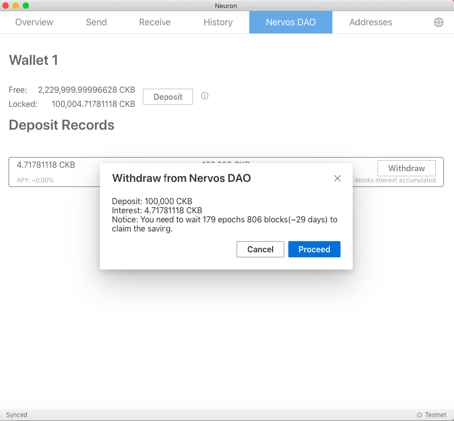

After 4 epochs, will display details.

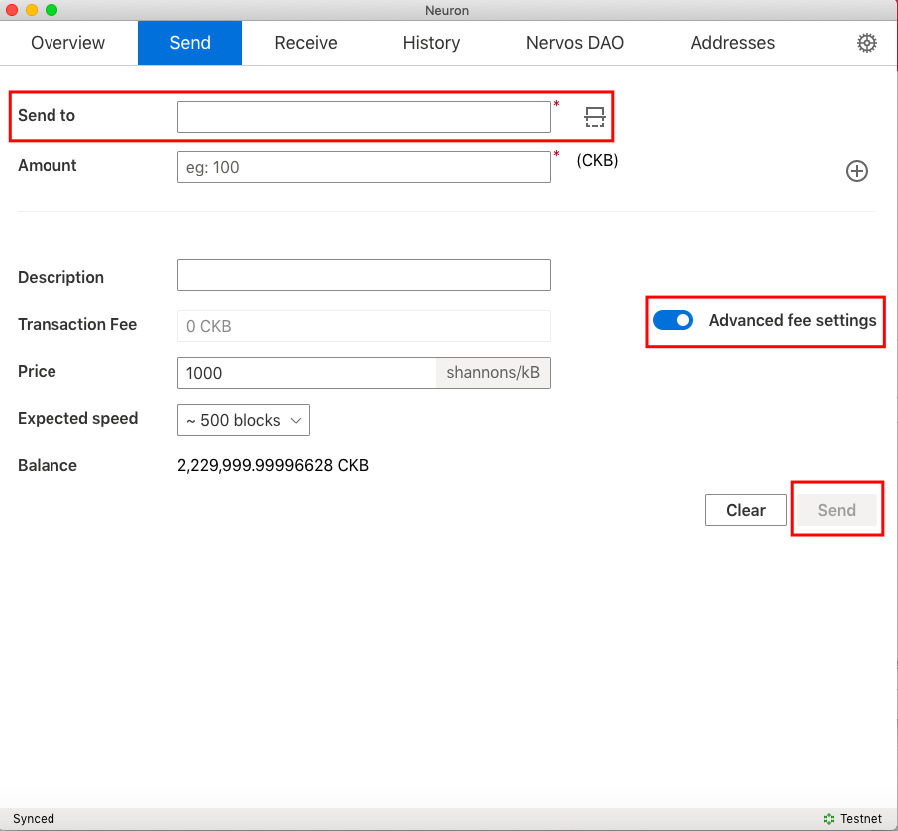


## How to transfer CKBytes from the Neuron Wallet to other wallets and exchanges

**Please read the disclaimer below before transacting on mainnet**

You should have the third party wallet/exchange destination address. **Please make sure your balance is greater than 62 CKB.**

* Under the “Send” tab, fill in the address details in the "Send to" field. Turn on the "Advanced fee settings" and fill in the "Transaction fee" — click  the "Send" button to complete your transfer.


# *Important

The bootstrapping of a proof-of-work (PoW) chain is difficult. A new PoW chain is in many ways like a newborn baby — weak in the beginning, but with unlimited potential when mature.

For a new PoW chain, risks may come from:

1. **Unstable Hashrate：** as the mining rewards will change drastically upon mainnet launch, an increase of hashrate is anticipated. It will create forks and uncle blocks in the first few weeks and the block time may be longer than expected due to NC-MAX's self adjustment. **For security, using a sufficiently large confirmation number is recommended before transferring CKBytes.**
2. **Immature Toolchain：** Early adopters of CKB technology should have a good understanding of NC-MAX, Cell model and CKB-VM to begin, otherwise mistakes or bugs may be created unintentionally. **The SDKs provided by Nervos Foundation are convenient tools to simplify RPC invocation and transaction building/signing/sending, but have not been tested in a production environment yet, please use them cautiously.**

We recommend CKB users exercise strong diligence in making any transactions during the first 2 to 4 weeks of mainnet as the chance of a re-org is possible and may reverse transactions that had previous been sent. **If you need to send transaction in the early weeks, choose a sufficiently large confirmation number before transferring CKBytes.**

# *Disclaimer
AS A DECENTRALIZED BLOCKCHAIN, NERVOS FOUNDATION DOES NOT CONTROL THE NERVOS CKB OR THE CKBYTES, AND DOES NOT HAVE THE ABILITY TO STOP, BLOCK OR REVERSE ANY TRANSACTIONS. NERVOS FOUNDATION DOES NOT MAKE ANY WARRANTIES WHATSOEVER WITH RESPECT TO THE NERVOS CKB OR THE CKBYTES, INCLUDING ANY (i) WARRANTY OF MERCHANTABILITY; (ii) WARRANTY OF FITNESS FOR A PARTICULAR PURPOSE; (iii) WARRANTY OF TITLE; OR (iv) WARRANTY AGAINST INFRINGEMENT OF INTELLECTUAL PROPERTY RIGHTS OF A THIRD PARTY; WHETHER ARISING BY LAW, COURSE OF DEALING, COURSE OF PERFORMANCE, USAGE OF TRADE, OR OTHERWISE. YOU ACKNOWLEDGE THAT YOU HAVE NOT RELIED UPON ANY REPRESENTATION OR WARRANTY MADE BY THE FOUNDATION OR ANY OTHER PERSON ON ITS BEHALF. YOU ASSUME ALL RISKS AND LIABILITIES FOR THE RESULTS OBTAINED BY THE USE OF ANY CKBYTES AND REGARDLESS OF ANY ORAL OR WRITTEN STATEMENTS MADE BY THE FOUNDATION, BY WAY OF TECHNICAL ADVICE OR OTHERWISE.
