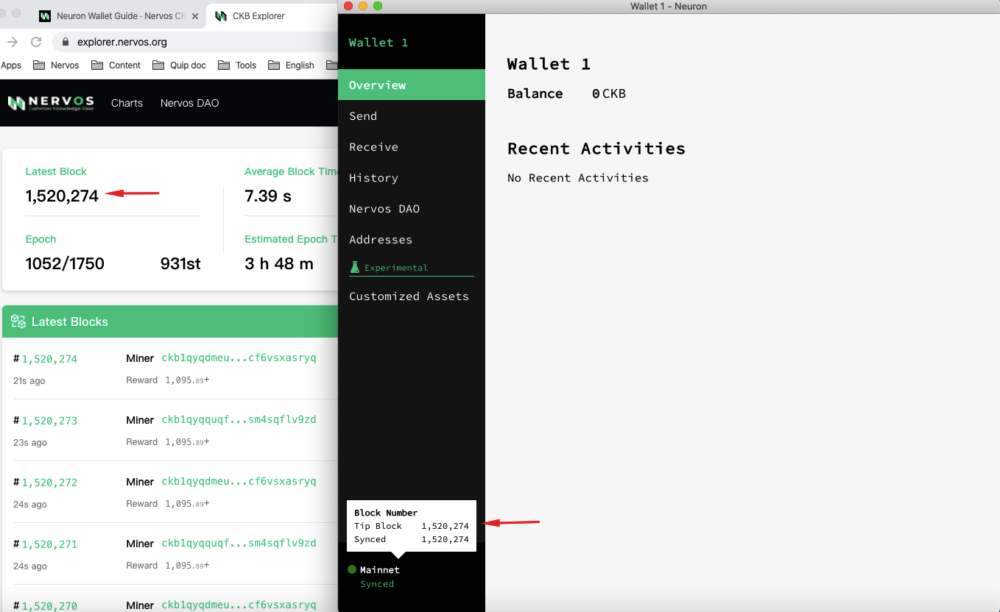
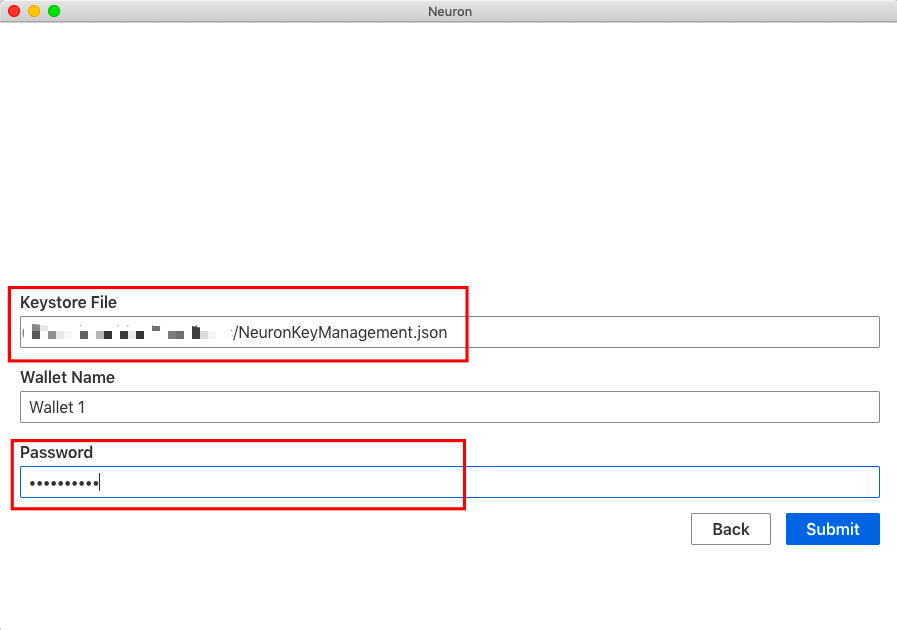
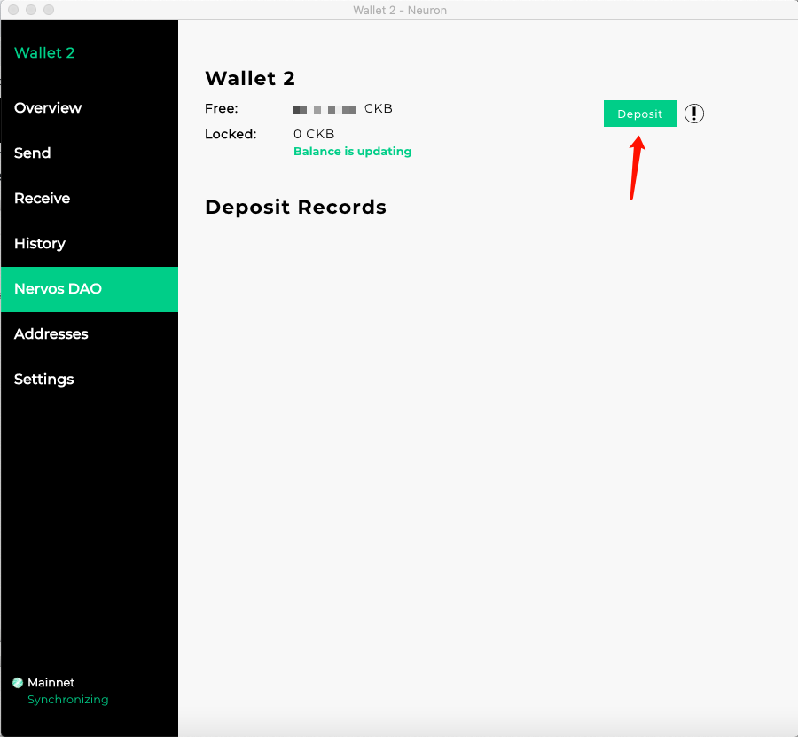
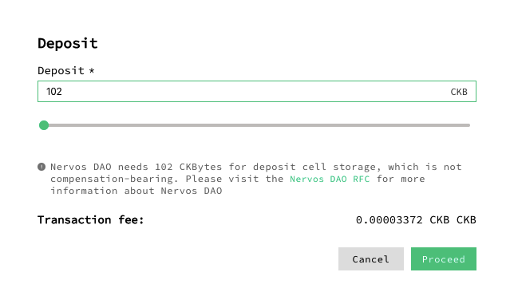
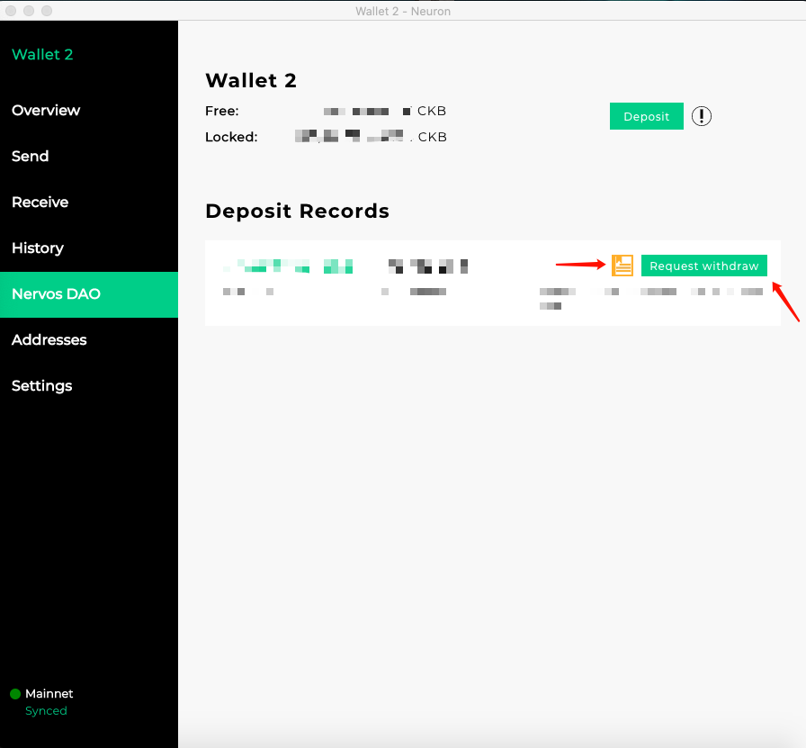
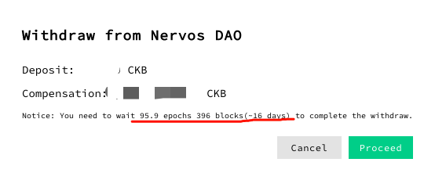
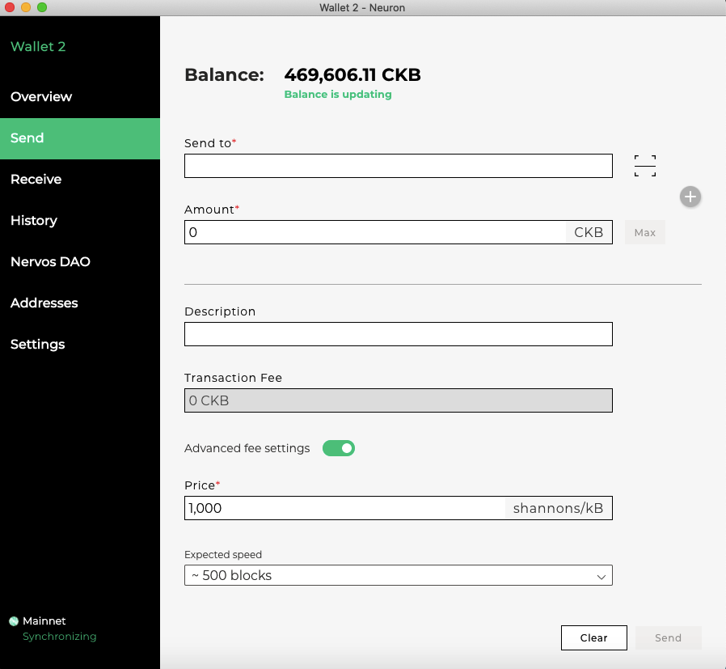

Following mainnet launch, if you hold a keystore file or a seed phrase generated from the Neuron Key Manager, you can use the Neuron wallet to receive your tokens or create a new wallet to store your tokens and deposit in the Nervos DAO. 

Now Neuron Wallet has bundled a CKB Mainnet node and configured to connect to the CKB Mainnet. After installation, as you open the Neuron Wallet, the bundled Mainnet node will run.

You can also run a CKB node yourself and launch Neuron wallet, then Neuron will NOT start the bundled node, but connects to your node instead. [run a CKB mainnet node](/getting-started/run-node)

Please follow these instructions which are explained in detail below：

- Download and install Neuron Wallet
- Wait for the synchronization to end
- Create a new wallet or import your keystore file or seed phrase to the Neuron Wallet

Bonus guides:

- Deposit into Nervos DAO
- Withdraw from Nervos DAO
- How to transfer CKBytes from the Neuron Wallet to other wallets and exchanges

If you run into issues when following this guide, please join the [Support](https://discord.gg/n6tx7uC) channel for support.

**IMPORTANT: The Nervos Team will NEVER ask for your private key, keystore file, mnemonic seed phase or wallet password. You should NEVER share this information with anyone, doing so may result in loss of all your tokens.**
* * *

## 1. Download and install the Neuron Wallet

Download the latest release version of the Neuron Wallet from the [Neuron Wallet releases page on Github](https://github.com/nervosnetwork/neuron/releases) and install it. **Please make sure that the version is v0.29.0 or later.** Import your keystore file or seed phrase that was previously generated by the Neuron Key Manager (full guide below), wait for the synchronization to end, and then you should see that the wallet’s balance has changed.

## 2. Wait for the synchronization to end
You can cross-check the Block Number with CKB-Explorer's Latest Block to make sure the synchronization to end.

## 3. Create a new wallet or import your keystore file or seed phrase to the Neuron Wallet

If you are using a new wallet, you can simply follow the steps within the Neuron Wallet.

If you are importing a existing wallet or your private keys were generated by the Neuron Key Manager please follow the steps below.

To access your tokens, you will need to import your private keys into the **Neuron Wallet**. This can be done using the mnemonic seed phase that was given to you when creating your address via Neuron Key Manager (image 3.1) **or** by exporting the private key (keystore file) via the “Backup Current Wallet” option in Neuron Key Manager (image 3.2).

*3.1 Screenshot of example wallet seed when creating address using the Neuron Key Manager tool*

*3.2 screenshot of exporting private key from Neuron Key Manager tool*

- Backup / export your keystore file (a .json file matching the name you chose for your wallet)  from the Neuron Key Manager, **or** use the mnemonic seed (a regular phrase of 12 words) generated when you create a wallet with the Neuron Key Manager.
- Import the keystore file **or** mnemonic seed phrase when setting up the Neuron Wallet.
  - To import the keystore file, choose “Import from Keystore” and input your password - Wait for synchronization to end. **The password must match the original password from the Neuron Key Manager.**

- To import the mnemonic seed phrase, choose “Import Wallet Seed”, fill in your password and wait for synchronization to end. **The password does not need to match the original password from the Neuron Key Manager.**

Congratulations, once the Neuron wallet is synced, you will have full access to your tokens! You can send  and receive CKBytes and deposit into the Nervos DAO.

## How to deposit your Nervos CKByte tokens into Nervos DAO

The [economic model](https://github.com/nervosnetwork/rfcs/blob/master/rfcs/0015-ckb-cryptoeconomics/0015-ckb-cryptoeconomics.md) of Nervos CKB is designed to allow token holders to lock tokens in the Nervos DAO to mitigate the inflationary effect of the secondary issuance. In this case, the inflationary effect of secondary issuance is expected to be nominal, equivalent to holding tokens with a hard cap. Please refer to [Nervos DAO Explained](https://medium.com/nervosnetwork/nervos-dao-explained-95e33898b1c) for more details). 

**Please make sure your balance is greater than 102 CKB.**

- Open the Neuron Wallet (the latest version), select “Nervos DAO” and “Deposit”.

## How to withdraw your Nervos CKByte tokens from the Nervos DAO

> Please read the disclaimer below before transacting on mainnet

`Deposit Records` will display your deposit records’ list，you can click `Request withdraw`.

## How to transfer CKBytes from the Neuron Wallet to other wallets and exchanges

> **Please read the disclaimer below before transacting on mainnet**

You should have the third party wallet/exchange destination address. **Please make sure your balance is greater than 62 CKB.**

- Under the “Send” tab, fill in the address details in the "Send to" field. Turn on the "Advanced fee settings" and fill in the "Transaction fee" — click  the "Send" button to complete your transfer.

## Troubleshooting

### Sync failed. XXX /Sync is slow XXX

1. Quit and restart app several times.

Note: The Neuron bundled CKB node requires [VC++ redistributable](https://support.microsoft.com/en-us/help/2977003/the-latest-supported-visual-c-downloads) on Windows to work properly. 

2. If step1 can't resolve, please [run a CKB mainnet node](/getting-started/run-node) and make sure the version is v0.31.0 or later instead of running the Neuron bundled node. 

3. if it still doesn't work out, please join the [Support](https://discord.gg/n6tx7uC) channel, export debug information and send it.

## Important

The bootstrapping of a proof-of-work (PoW) chain is difficult. A new PoW chain is in many ways like a newborn baby — weak in the beginning, but with unlimited potential when mature.

For a new PoW chain, risks may come from:

1. **Unstable Hashrate：**as the mining rewards will change drastically upon mainnet launch, an increase of hashrate is anticipated. It will create forks and uncle blocks in the first few weeks and the block time may be longer than expected due to NC-MAX's self adjustment. **For security, using a sufficiently large confirmation number is recommended before transferring CKBytes.**
2. **Immature Toolchain：**Early adopters of CKB technology should have a good understanding of NC-MAX, Cell model and CKB-VM to begin, otherwise mistakes or bugs may be created unintentionally. **The SDKs provided by Nervos Foundation are convenient tools to simplify RPC invocation and transaction building/signing/sending but have not been tested in a production environment yet, Please use them cautiously.**

We recommend CKB users exercise strong diligence in making any transactions during the first 2 to 4 weeks of mainnet as the chance of a re-org (reorganization of the current valid chain) is possible and may reverse transactions that had previous been sent. **If you need to send transaction in the early weeks, choose a sufficiently large confirmation number before transferring CKBytes.**

## Disclaimer

AS A DECENTRALIZED BLOCKCHAIN, NERVOS FOUNDATION DOES NOT CONTROL NERVOS CKB OR CKBYTES AND DOES NOT HAVE THE ABILITY TO STOP, BLOCK OR REVERSE ANY TRANSACTIONS. NERVOS FOUNDATION DOES NOT MAKE ANY WARRANTIES WHATSOEVER WITH RESPECT TO THE NERVOS CKB OR CKBYTES, INCLUDING ANY (i) WARRANTY OF MERCHANTABILITY; (ii) WARRANTY OF FITNESS FOR A PARTICULAR PURPOSE; (iii) WARRANTY OF TITLE; OR (iv) WARRANTY AGAINST INFRINGEMENT OF INTELLECTUAL PROPERTY RIGHTS OF A THIRD PARTY; WHETHER ARISING BY LAW, COURSE OF DEALING, COURSE OF PERFORMANCE, USAGE OF TRADE, OR OTHERWISE. YOU ACKNOWLEDGE THAT YOU HAVE NOT RELIED UPON ANY REPRESENTATION OR WARRANTY MADE BY THE FOUNDATION OR ANY OTHER PERSON ON ITS BEHALF. YOU ASSUME ALL RISKS AND LIABILITIES FOR THE RESULTS OBTAINED BY THE USE OF ANY CKBYTES AND REGARDLESS OF ANY ORAL OR WRITTEN STATEMENTS MADE BY THE FOUNDATION, BY WAY OF TECHNICAL ADVICE OR OTHERWISE.
