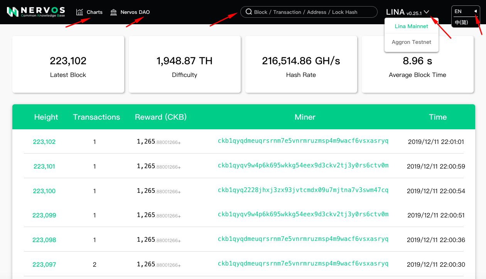
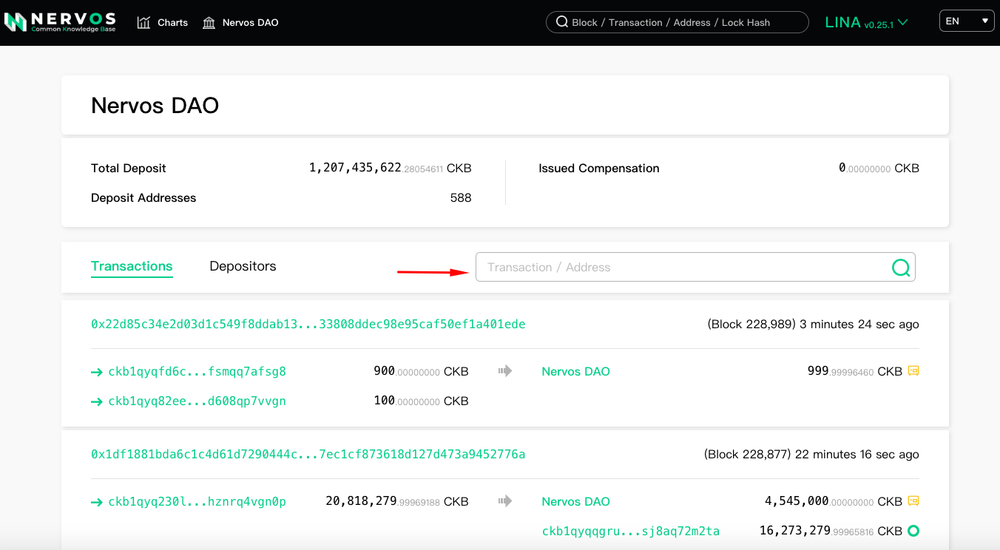
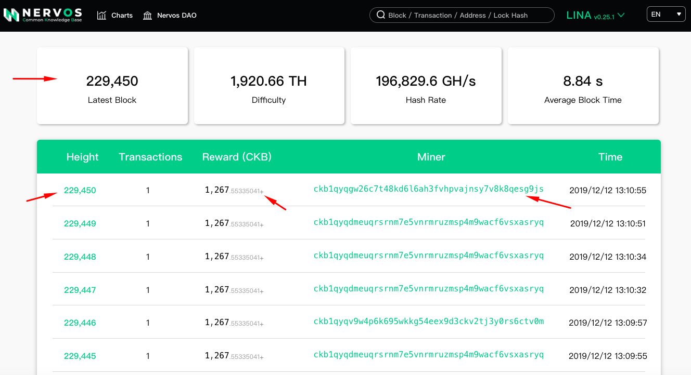

[Github](https://github.com/nervosnetwork/ckb-explorer) | [Lina Mainnet](https://explorer.nervos.org/) | [Aggron Testnet](https://explorer.nervos.org/aggron/)

CKB-Explorer allows you to explore addresses, tokens, blocks, hashrate, Nervos DAO info and all other activities taking place on Nervos CKB. 

**Please note that CKB-Explorer is not a wallet service provider. We do not store your private keys and we have no control over the transactions that take place over the CKB Network.**

In this section we will give an overall introduction to CKB-Explorer:

### Navigation bar 

CKB-Explorer supports both Lina Mainnet and Aggron Testnet. You can search by block/Transaction/Address/Lock Hash.
Also you can click `Charts` and `Nervos DAO` for more details.

So far,  `Charts` includes 「Difficulty & Hash Rate」,「Difficulty & Uncle Rate」,「Transaction Count」,「Address Count」,「Cell Count」,「Total Nervos DAO deposit 」, and「 Balance Ranking」

We will continue to optimize the related features to allow “deep dives” on data and analytics. 

`Nervos DAO` displays detailed information about Nervos DAO, such as total deposit, deposit addresses count and transactions. You can search to find your CKBytes locked in the Nervos DAO by `Transaction/Address`

In particular, we provide a ranking list for the top 100 depositors to thank people for their contributions to the Nervos ecosystem.

### The main interface

The main interface displays blockchain status and blocks’ list. It’s convenient for skimming through Lina Mainnet or Aggron Testnet’s info.

You can also click the green colored links to view block details and the address related transactions in those blocks. 

 `Reward（CKB）`displays the primary reward (which isn’t the whole block reward). According to [CKB Consensus Protocol](https://github.com/nervosnetwork/rfcs/blob/master/rfcs/0020-ckb-consensus-protocol/0020-ckb-consensus-protocol.md), there are four parts of the block reward: primary reward, secondary reward, commit reward and proposal reward. 

The secondary reward, commit reward and proposal reward are calculated after block propagation, if you want to view the whole block reward, you can check the `Block Reward` in Block’s  `Overview`.

