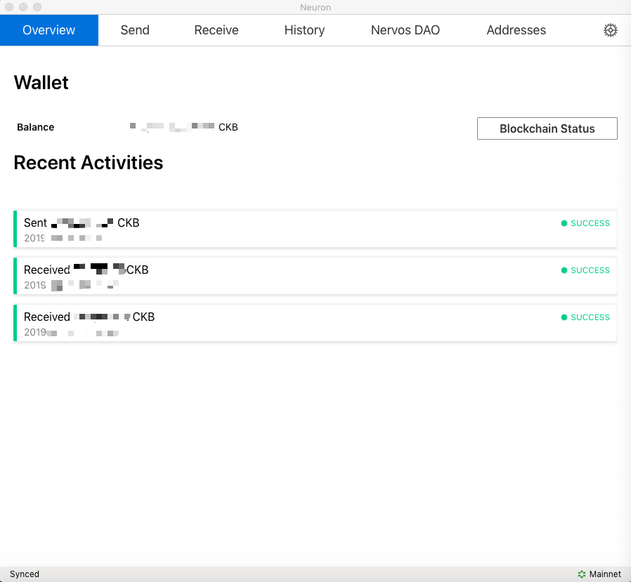
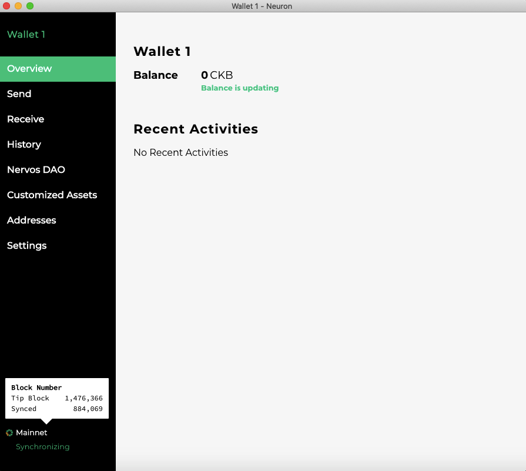
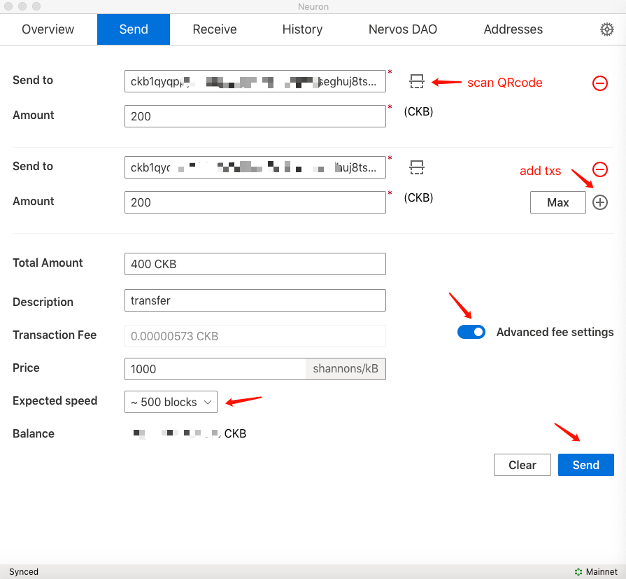
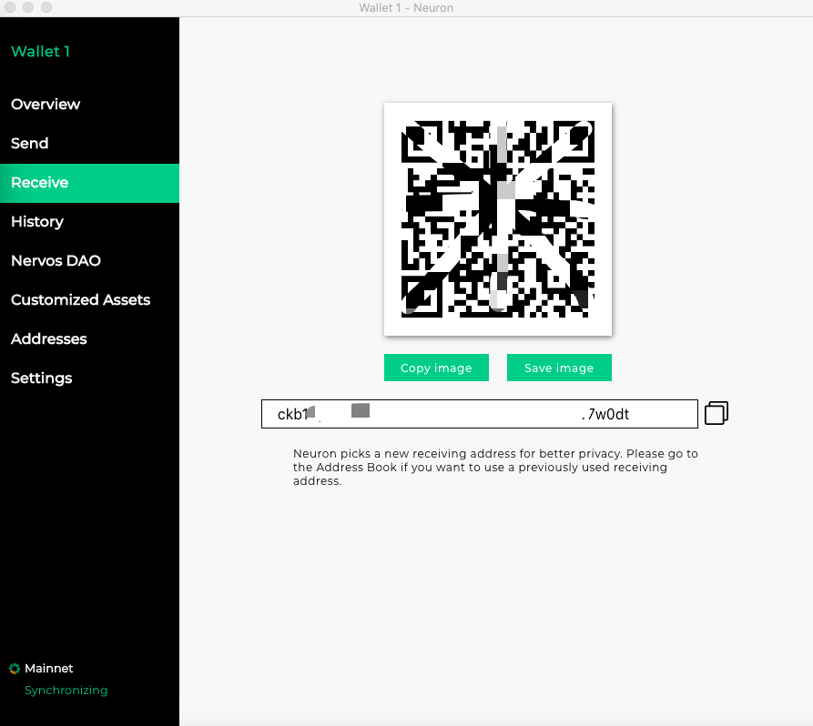
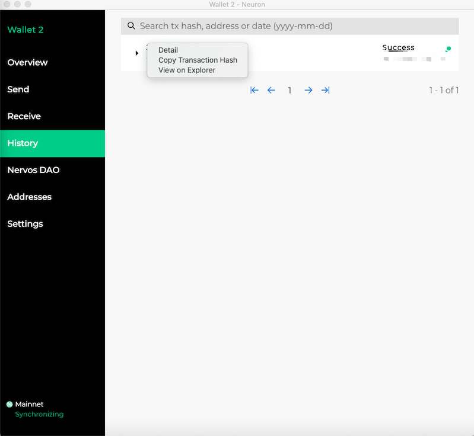
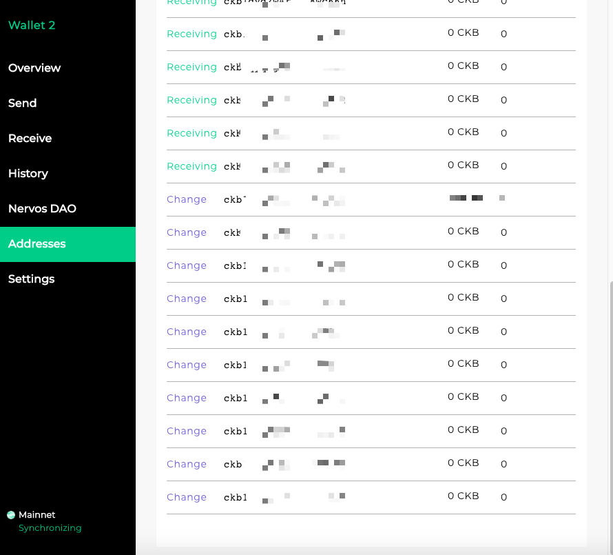
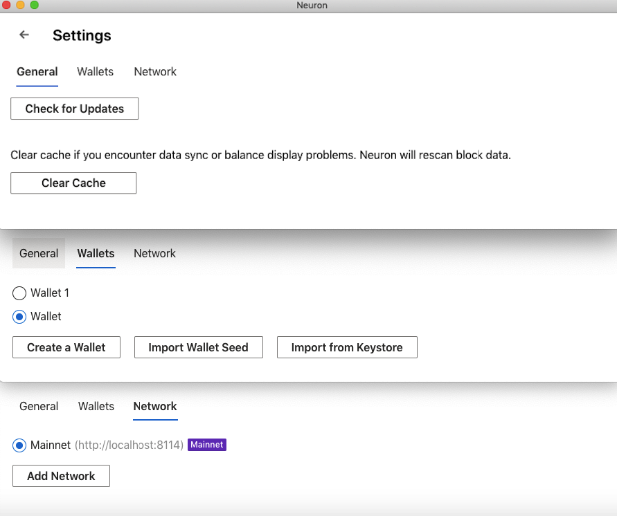

[Github](https://github.com/nervosnetwork/neuron) | [Download](https://github.com/nervosnetwork/neuron/releases)

A blockchain wallet is very important in the blockchain ecosystem, it is a user’s gateway to the blockchain world. 

Neuron Wallet is a CKB wallet produced by the Nervos Foundation, it holds your keys and can create and broadcast transactions on your behalf. The functionality of the Neuron Wallet is focused on transfer of CKBytes and deposit/withdrawal functions of the Nervos DAO.

If you want to create and broadcast transactions, you will need to run a CKB node or rely on a 3rd party’s node to connect to the Nervos CKB blockchain. It is convenient to run a CKB (for anyone!) and it’s also risky to relay on a 3rd party node. 

With the v0.26.0 release of Neuron Wallet, a CKB node is now included in the wallet and configured to connect to the CKB Mainnet. After installation, as you open the Neuron Wallet, the bundled Mainnet node will run.

If you prefer to run your own node (maybe for development purposes), you still can. Please make sure the node is running before launching the Neuron wallet, the wallet will then connect to your local node instead of the one bundled in the wallet.

In this section we will give an overall introduction to Neuron Wallet. Tutorials are included in the [Getting Started](/getting-started/introduction) and [Neuron Wallet Guide](/references/neuron-wallet-guide) sections.

Please [download](https://github.com/nervosnetwork/neuron/releases) and install the latest Neuron Wallet version, click `Create a New Wallet`, and you will then see the main interface. There are seven tabs: **Overview, Send, Receive, History, Nervos DAO, Addresses and Settings**.

### Overview

`Overview`  displays the 「Wallet name」「Balance」「Recent Activities」「Blockchain Status」

You can cross-check the `Block Number` in `Blockchain Status` with `Latest Block`  in [CKB-Explorer](https://explorer.nervos.org/) to make sure the node is synced.

### Send

You can create transactions and transfer CKByte tokens. Please make sure the node is synced before sending transactions. 

### Receive

`Receive`  displays the wallet’s address and QRcode.

### History

Here you can search for previous transactions. Right click on the list and you can check the 「Detail」 「Copy Transaction Hash」「View on Explorer」

### Nervos DAO

Information about the economic function of the Nervos DAO is [here](https://medium.com/nervosnetwork/nervos-dao-explained-95e33898b1c), with this functionality you can deposit and withdraw CKBytes through Neuron Wallet. 

### Addresses

Neuron Wallet is HD（Hierarchical Determinstic）wallet defined by BIP32, BIP39,BIP-43 and BIP-44. It is developed to derive 20 Receiving addresses and 10 change addresses from a “seed phrase”. It’s recommended to refer to [Mastering Bitcoin-Chapter 4- Wallets](https://www.oreilly.com/library/view/mastering-bitcoin/9781491902639/ch04.html) for more details.

### Settings

`Settings` has three parts:

* `General` : you can check for updates and clear cache.
* `Wallets` : you can choose the wallet being used, create a wallet, import wallet seed and import from Keystore. 
* `Network` : you can add network’s RPC URL and choose the network the wallet is connected to.

